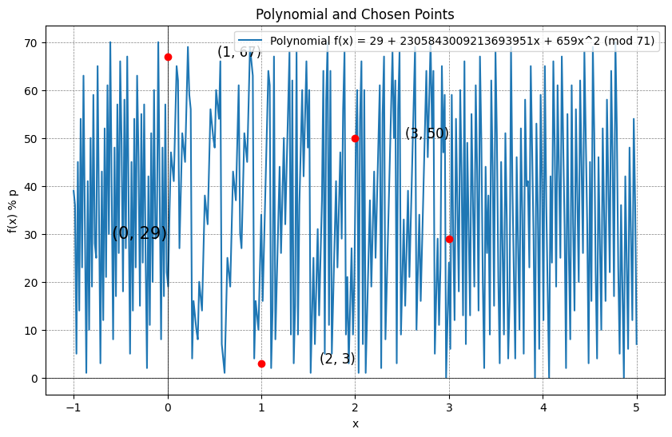
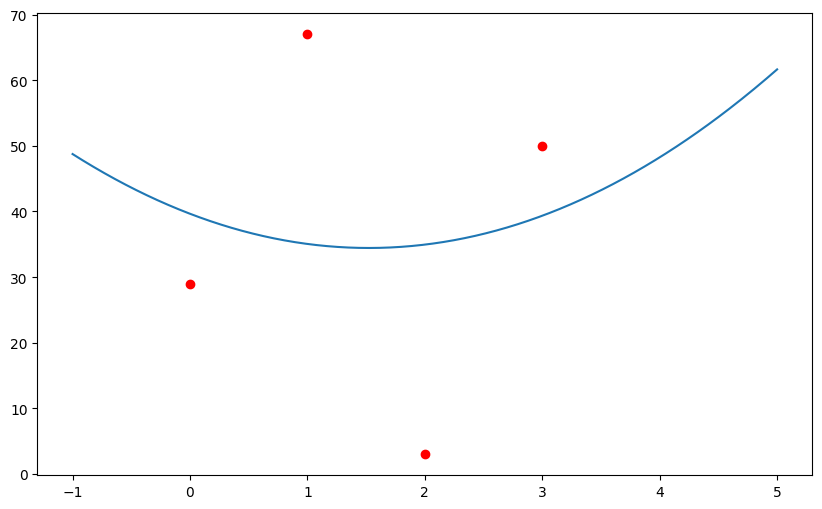
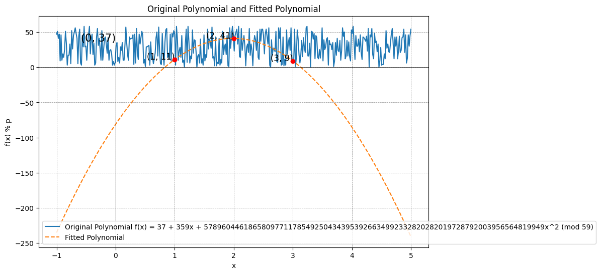

# Polynomial Modulo Plotting
Demonstrates the evaluation and visualization of a polynomial modulo a large prime number. The polynomial is given by its coefficients, and the modulo operation ensures that the polynomial values are constrained within the range of the prime number.

## Demo
- Polynomial Evaluation: Compute the values of a polynomial at specific points modulo a prime number.
- Lagrange Interpolation: Recover the secret (constant term) using shares and Lagrange interpolation.
- Polynomial Fitting: Fit a polynomial to the computed values.
- Visualization: Plot the original polynomial and the fitted polynomial, focusing on a specific range of values.

